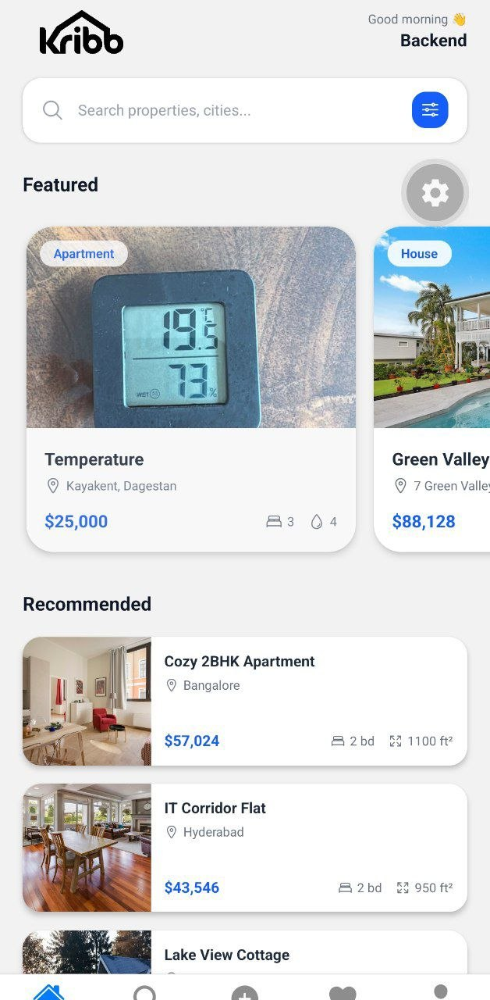
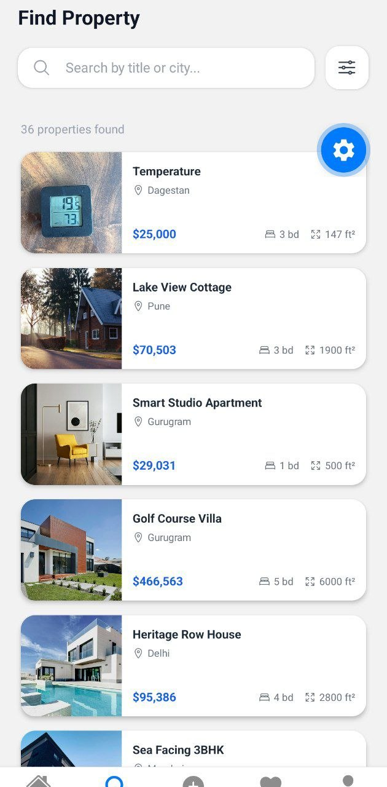
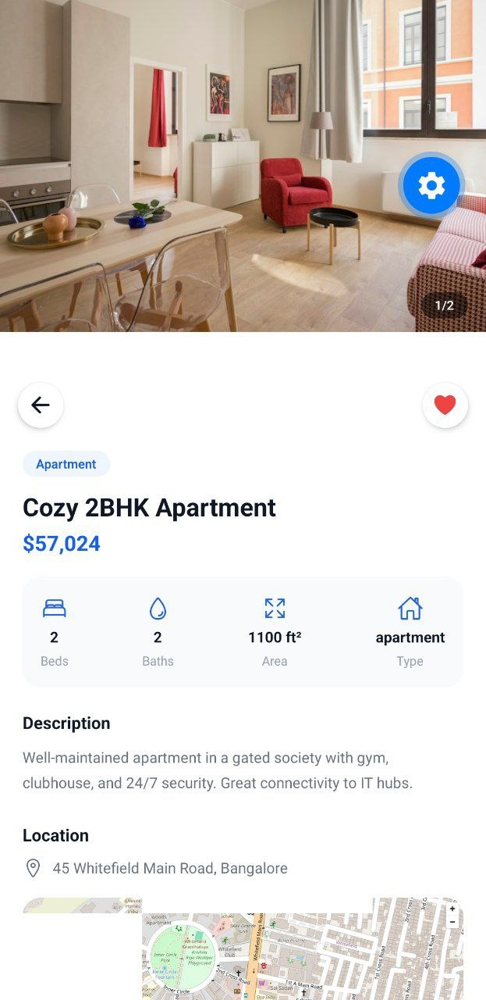
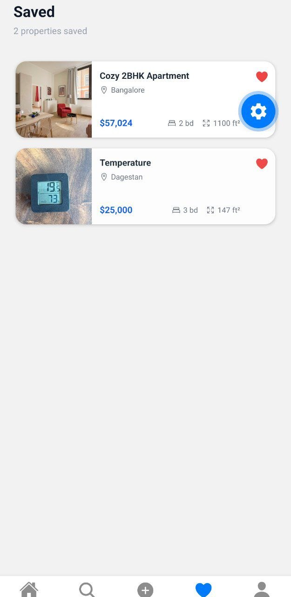
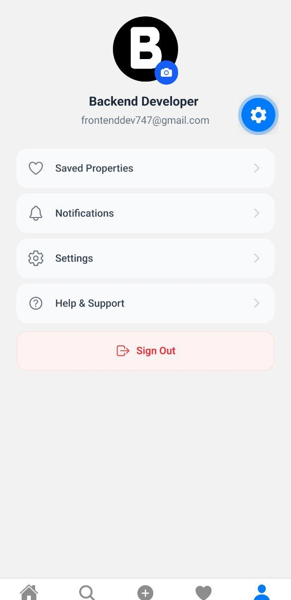
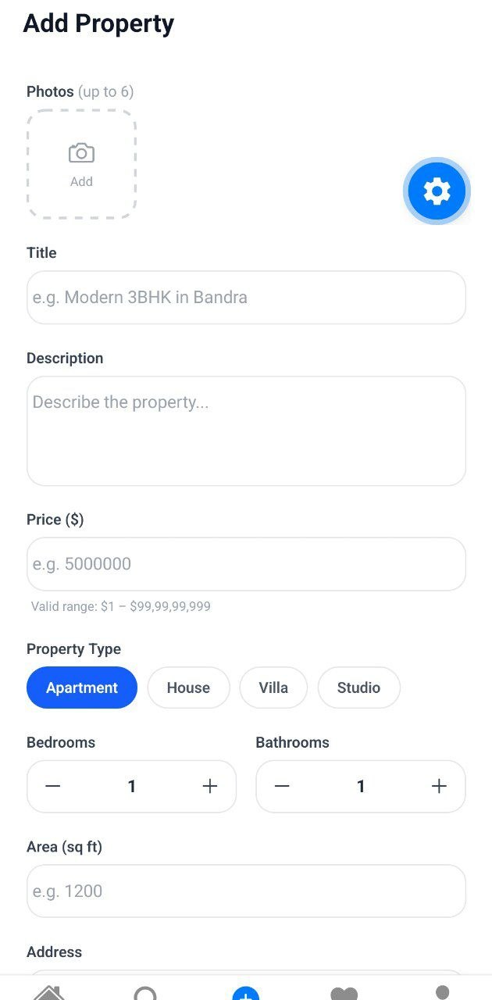

# Kribb

Мобильное приложение для поиска и размещения объявлений о недвижимости. Пользователи могут просматривать подборки объектов, искать жильё с фильтрами, сохранять понравившиеся объявления и публиковать свои.

## Возможности

- Регистрация, вход и подтверждение email.
- Просмотр рекомендуемых и избранных объектов.
- Поиск по названию и городу, фильтрация по типу недвижимости, цене и количеству спален.
- Подробная информация об объекте и его фотографиях.
- Добавление объявления с загрузкой фотографий и определением координат.
- Профиль пользователя и список сохранённых объектов.

## Технологии

- React Native, Expo и TypeScript
- Expo Router для навигации
- Supabase для данных и хранения изображений
- Clerk для аутентификации
- Zustand для состояния фильтров
- NativeWind для стилизации

## Скриншоты

| Экран | Описание |
| --- | --- |
|  | **Вход.** Авторизация пользователя по email и паролю. |
|  | **Регистрация.** Создание аккаунта с указанием имени, email и пароля. |
|  | **Подтверждение email.** Ввод кода подтверждения для завершения регистрации. |
|  | **Главная.** Подборки рекомендованных и выделенных объектов с быстрым переходом к поиску. |
|  | **Поиск.** Просмотр объявлений и фильтрация по параметрам недвижимости. |
|  | **Карточка объекта.** Фотографии и подробная информация о выбранной недвижимости. |
|  | **Избранное.** Список сохранённых объявлений. |
|  | **Профиль.** Данные аккаунта, смена фото профиля и выход из приложения. |
|  | **Добавление объекта.** Форма публикации объявления с фотографиями и данными о недвижимости. |

## Запуск

Установите зависимости:

```bash
npm install
```

Создайте файл `.env` и укажите переменные для Supabase и Clerk:

```env
EXPO_PUBLIC_SUPABASE_URL=
EXPO_PUBLIC_SUPABASE_KEY=
EXPO_PUBLIC_CLERK_PUBLISHABLE_KEY=
```

Запустите приложение:

```bash
npx expo start
```
